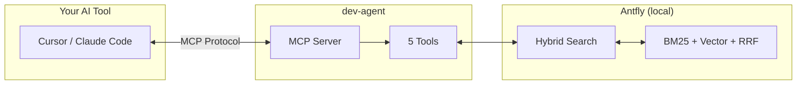

import { Callout, Steps, Tabs } from 'nextra/components'
import { latestVersion } from './latest-version'

# dev-agent

Local semantic code search for Cursor and Claude Code via MCP.

[Get Started](/docs) · [View on GitHub](https://github.com/prosdevlab/dev-agent)

<Callout type="info">
  **New in v{latestVersion.version}** — {latestVersion.summary} [See what's new →](/updates)
</Callout>

<Callout type="default">
  **Built by engineers, for engineers.** An MCP server that gives your AI tools semantic code search — find code by meaning, not keywords. Everything runs locally. Your code never leaves your machine.
</Callout>

## What it does

Your AI tool gets 5 MCP tools that understand your codebase:

| Tool | What it does |
|------|--------------|
| [`dev_search`](/docs/tools/dev-search) | Hybrid search (BM25 + vector + RRF) — returns code snippets, not just file paths |
| [`dev_refs`](/docs/tools/dev-refs) | Find callers/callees of any function |
| [`dev_map`](/docs/tools/dev-map) | Codebase structure with hot paths (most referenced files) |
| [`dev_patterns`](/docs/tools/dev-patterns) | Compare coding patterns against similar files |
| [`dev_status`](/docs/tools/dev-status) | Repository indexing status, health checks, and Antfly stats |

## How it works



1. **Index** — Scanner parses your code (ts-morph for TypeScript, tree-sitter for Go), extracts functions, classes, types, imports, and call graphs
2. **Embed** — Antfly generates vector embeddings locally via Termite (ONNX, BAAI/bge-small-en-v1.5)
3. **Search** — Hybrid search combines BM25 keyword matching with vector similarity, fused via Reciprocal Rank Fusion (RRF)
4. **Auto-update** — File watcher detects changes and re-indexes automatically while the MCP server is running

## Why it helps

Instead of grep chains and reading entire files, your AI tool can ask conceptual questions:

| Question | Without dev-agent | With dev-agent |
|----------|-------------------|----------------|
| "Where do we handle auth?" | `grep -r "auth"` → 200 matches | `dev_search "authentication"` → 5 ranked results with code |
| "What calls this function?" | Manual file reading | `dev_refs "validateUser"` → callers + callees |
| "What's in this codebase?" | `ls`, `find`, read READMEs | `dev_map` → structure with component counts |

The key difference: semantic search finds code by **meaning**, not text matching. "Where do we handle errors?" finds try/catch blocks, error middleware, and validation functions — even if none contain the word "error."

## Quick Start

<Steps>
### Install

```bash
npm install -g @prosdevlab/dev-agent
```

### Setup and index

```bash
dev setup
dev index
```

### Connect to your AI tool

```bash
dev mcp install --cursor  # For Cursor
dev mcp install           # For Claude Code
```
</Steps>

## Features

- **Hybrid Search** — BM25 keyword + vector semantic, fused with RRF
- **Code Snippets** — Search returns actual code, not just file paths
- **Call Graph** — Callers/callees extracted from AST at index time
- **Multi-Language** — TypeScript, JavaScript, Python, Go, Markdown
- **100% Local** — Antfly runs on your machine. No data leaves.
- **Auto-Index** — File watcher re-indexes on save while MCP server runs
- **1,600+ Tests** — Production-grade reliability

---

MIT License

[Read the story behind dev-agent →](https://www.devbypros.com/blog/10-days-of-vibe-coding)
